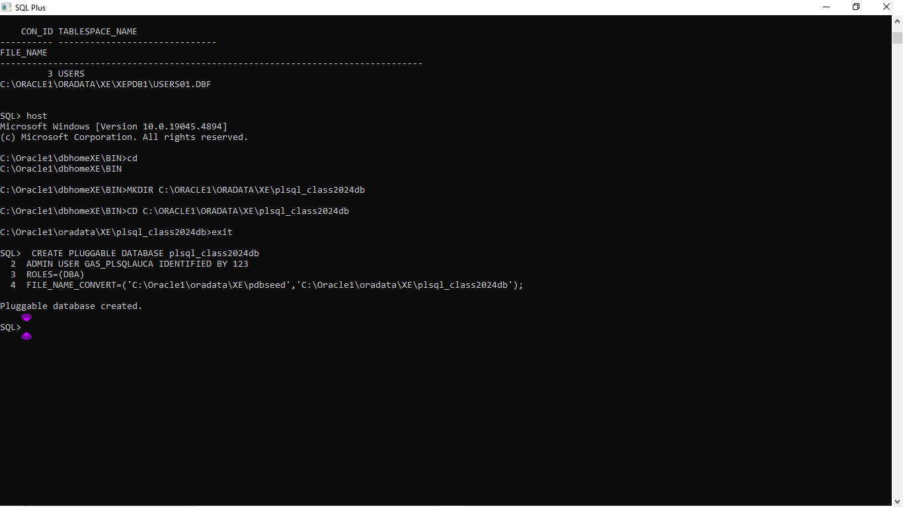
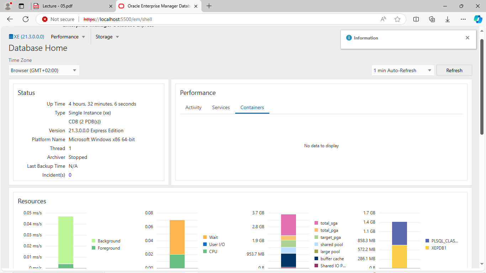
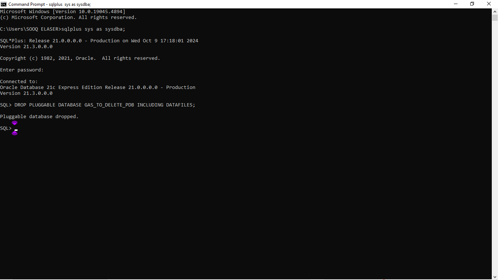
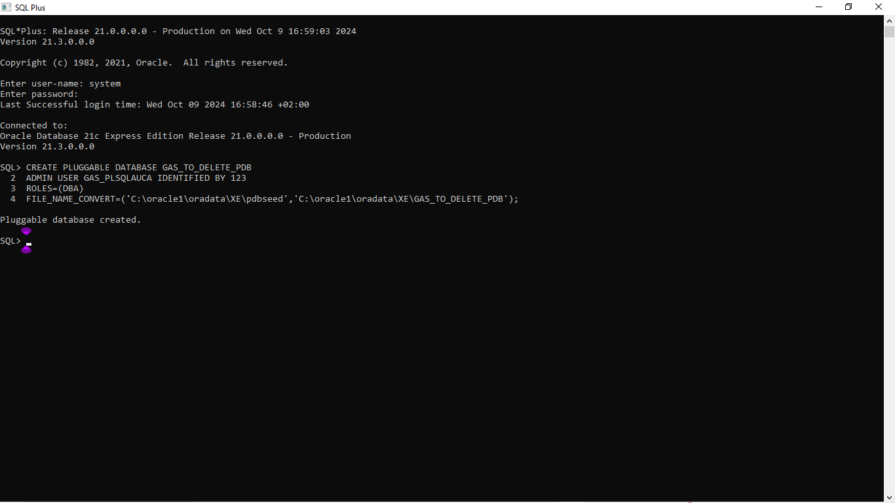
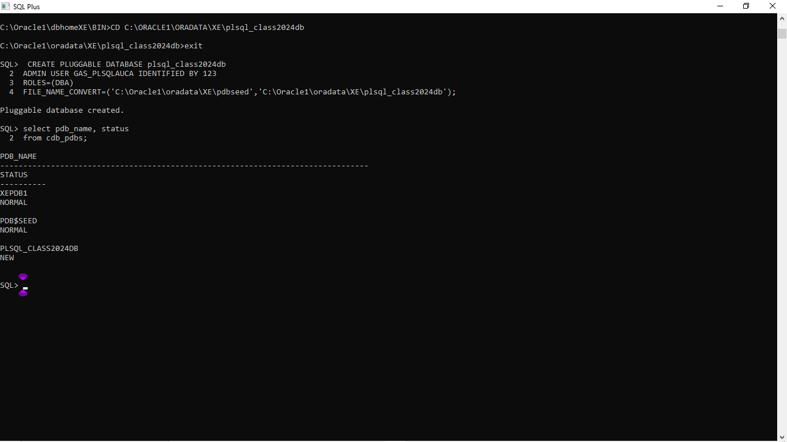

# Database Creation, Deletion & EOM 

This README provides an overview to what i have done,with codes and pictures/Screenshoot for the out put i have got.

### CREATE A PDB Named plsql_class2024db

CREATE PLUGGABLE DATABASE plsql_class2024db
ADMIN USER GAS_PLSQLAUCA IDENTIFIED BY 123
ROLES=(DBA)
FILE_NAME_CONVERT=('C:\oracle1\oradata\XE\pdbseed', 'C:\oracle1\oradata\XE\plsql_class2024db');
//after writting those codes properly that pluggable will be created.

### TO CHECK PDB STATUS

```sql
select pdb_name, status
from cdb_pdbs; 
//here you will see the pdb you have created.
```
### CREATION OF PLUGGABLE DATABASE CALLED GAS_TO_DELETE_PDB

```sql
CREATE PLUGGABLE DATABASE GAS_TO_DELETE_PDB
ADMIN USER GAS_PLSQLAUCA IDENTIFIED BY 123
ROLES=(DBA)
FILE_NAME_CONVERT=('C:\oracle1\oradata\XE\pdbseed', 'C:\oracle1\oradata\XE\GAS_TO_DELETE_PDB');

//after writting those codes properly, that pluggable will be created.
``
### DELETION OF PLUGGABLE DATABASE CALLED GAS_TO_DELETE_PDB
```sql
DROP PLUGGABLE DATABASE GAS_TO_DELETE_PDB INCLUDING DATAFILES;

//Once you write those codes properly, that pluggable will be Dropped/Deleted.

```
### screenshot of the dashboard after completing the above tasks 








### Conclusion
This Assignment was helping me to know how to create, delete PDB and to handle some errors in codes.  
#### License

All Right reserved by Me and My Collaborator  
"# PLSQL_Assignment3" 
